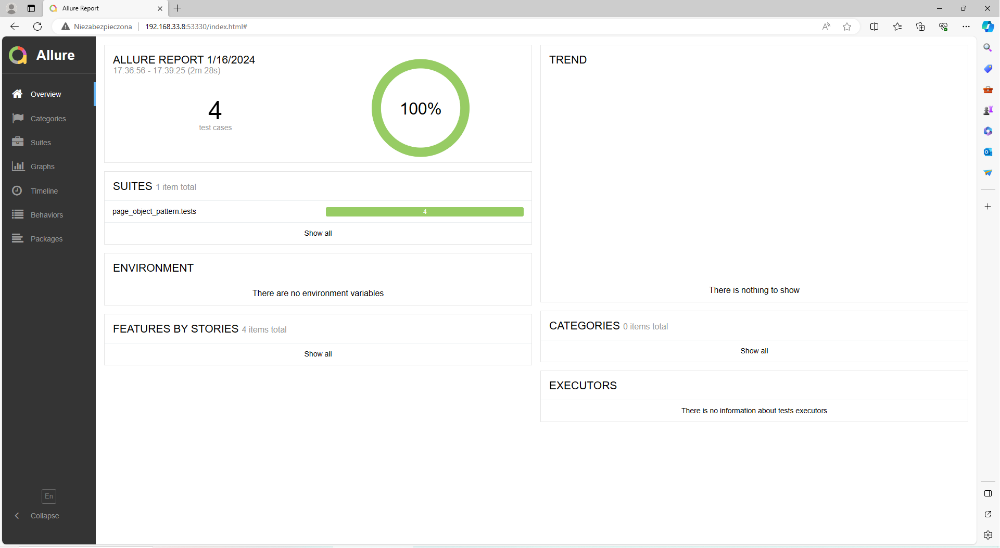

# General Info #
OBI-tests-of-DIY-store is a Selenium-Python project aimed at testing and presenting the results of OBI-tests-of-DIY-store. 

## Functionality ##

The project contains four tests: 
1) Successful log-in test 
2) Unsuccessful log-in test 
3) Successful account creation test 
4) Unsuccessful account creation test

## Testing environnement ##

The script as tested for windows 10 Home ( 22H2 64bits)
## Technologies ##

Technologies used: Selenium, Python.

## Getting Started ##

1. Install Python 3.x.x.
2. Install Pycharm Community Edition 2022.3.2.
3. Instal selenium
	```
	pip install selenium 4.11.2
	```
4. Install webdriver-manager 4.01
	```
	pip install webdriver-manager 4.0.1
	```
5. Install pytest 7.2.2
	```
	pip install pytest 7.2.2
	```
6. Install pytest-xdist 3.2.0
	```
	pip install pytest-xdist 3.2.0
	```
7. Install allure-pytest 2.13.1
	```
	pip install allure-pytest 2.13.1
	```
	```Configure allure-pytest. You will find it``` [here](https://www.skill2lead.com/allure-report/allure-report-pytest-allure-report-configuration.php/) 
	
8. Install xlrd
	```
	pip install 1.2.0
	```

## Using the app ##

1. Clone the repository to any folder by using
	```
	git clone https://github.com/PeterTomczyk/OBI-tests-of-DIY-store.git
	```
2. Open the project from PyCharm
3. Open "Windows Command Prompt"
4. In the ```Windows Command Prompt``` enter the following ```pytest --alluredir=absolute path to the "reports" file in this project``` and press enter
5. In the ```Windows Command Prompt``` enter the following ```allure serve absolute path to the "reports" file in this project``` and press enter
6. In the end you'll see the report in your browser.




### To see the project, visit my YouTube channel at: ###

https://www.youtube.com/watch?v=57RLcbR4_CE

